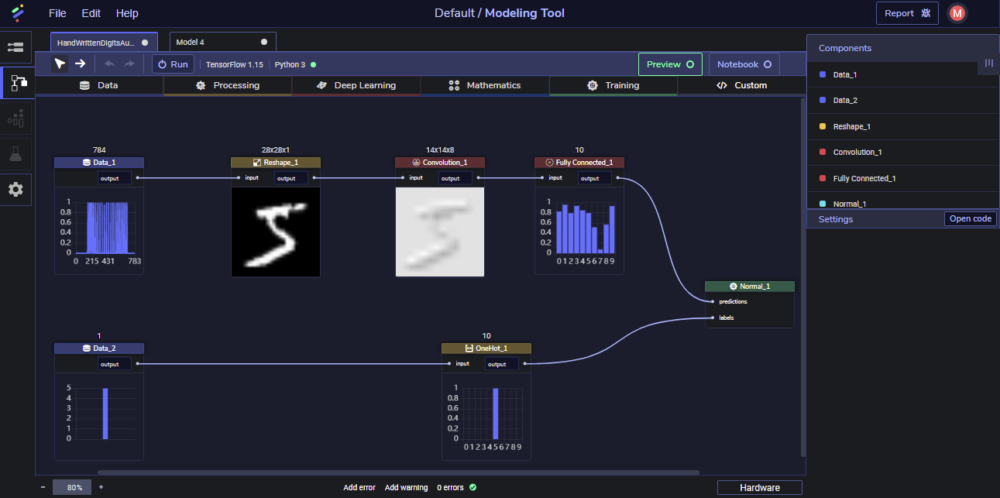
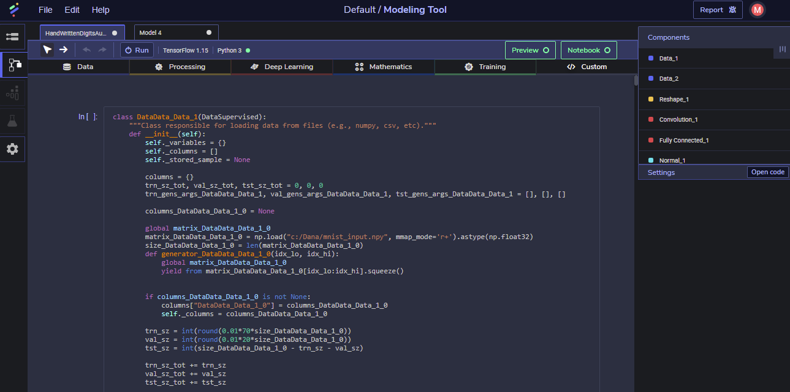
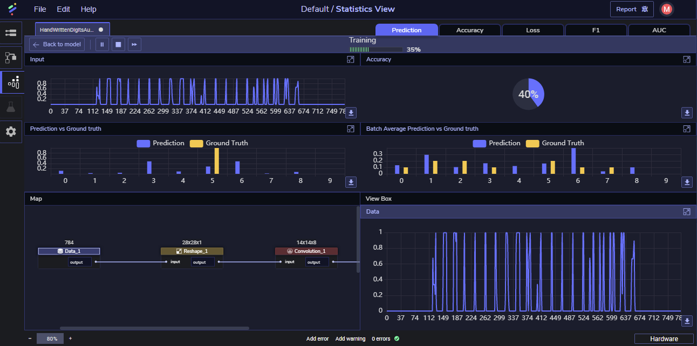

[](https://www.perceptilabs.com/home)

# PerceptiLabs

PerceptiLabs is a dataflow driven, visual API for TensorFlow that enables data scientists to work more efficiently with machine learning models and to gain more insight into their models. It wraps low-level TensorFlow code to create visual components, which allows users to visualize the model architecture as the model is being built.

This visual approach lowers the barrier of entry for beginners while providing researchers and advanced users with code-level access to their models. 







# Features

The following are some of the key features of PerceptiLabs:

* Shows the model architecture with output visualizations for each component
* Shows granular visualizations during the modeling phase, run-time, and testing
* Shows warnings and recommendations for debugging and model building
* Automatically suggests configs/settings and hyperparameters
* Provides access to the underlying code for editing in the tool
* Includes model templates for common machine learning problems
* Performs dimension and I/O shape fitting
* Includes a model registry to easily keep track of models and experiments
* Includes data and model version control to reproduce experiments and go back in time
* Can perform distributed training over all available GPUs
* Performs different tests to try out the model before pushing it to production

# Quickstart

PerceptiLabs is offered as a free Python package (hosted on [PyPI](https://pypi.org/project/perceptilabs/)) for everyone to use.

**Install it:**

```shell
pip install perceptilabs
```

**Run it:**

```shell
perceptilabs
```

This will run the PerceptiLabs kernel locally on your machine and launch its user interface in your web browser.

[Documentation →](https://www.perceptilabs.com/docs/overview)

# Community

Got questions, feedback, or want to join a community of machine learning practitioners working with exciting tools and projects? Check out our [forum](http://forum.perceptilabs.com/) and [Slack Channel](https://perceptilabs-com.slack.com/join/shared_invite/enQtODQ5NzAwNDkxOTExLWUxODAwZDk0MzA1MmM4OTViNWE4MmVjYjc2OTQwMTQ4N2NmM2ZlYmI5NjZjOWRiYjBkYjBjMTMzNjEyMDNiNDk)!

